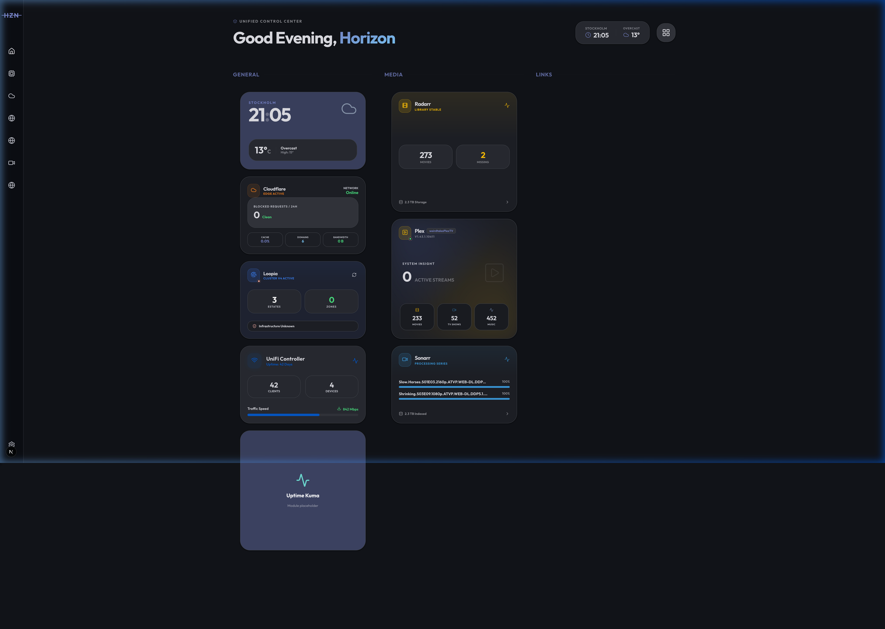

# 🌌 Horizon Dashboard

[](https://opensource.org/licenses/MIT)
[](https://nextjs.org/)
[](https://www.docker.com/)
[](https://snyk.io)
[](http://makeapullrequest.com)

**Horizon** is a premium, modular self-hosted dashboard designed for homelab enthusiasts and professionals. It provides a sleek, Material Design 3 (MD3) interface to monitor your infrastructure, manage media, and stay organized.



## ✨ Key Features

- 🧩 **Modular Architecture**: Install, remove, or develop your own modules (widgets & views) with zero-config auto-registration.
- 🎨 **Premium MD3 Design**: Beautiful glassmorphism, dynamic animations, and curated HSL accent palettes.
- 🐳 **Docker-Ready**: First-class support for containerized deployment with persistent storage.
- 🔐 **Security First**: Sanitized inputs, CSRF protection, and hardened API routes verified by Snyk.
- 📱 **Mobile Optimized**: A fully responsive interface that feels like a native app on any device.
- ⚡ **Real-time Engine**: Built with Next.js and Turbopack for lightning-fast performance and live updates.

---

## 🚀 Deployment

### 🐳 Option 1: Docker (Recommended)

The easiest way to get Horizon running is via Docker Compose.

1. **Create a `docker-compose.yml`**:

    ```yaml
    services:
        horizon:
            image: ghcr.io/weirdtales/horizon:latest
            container_name: horizon
            ports:
                - '3000:3000'
            volumes:
                - ./data:/app/data
            environment:
                - NEXT_PUBLIC_BASE_URL=http://your-ip:3000
            restart: unless-stopped
    ```

2. **Start the container**:
    ```bash
    docker-compose up -d
    ```

### 💻 Option 2: Bare Metal (Node.js)

1. **Clone & Install**:

    ```bash
    git clone https://github.com/weirdtales/horizon.git
    cd horizon
    npm install
    ```

2. **Build & Start**:
    ```bash
    npm run build
    npm run start
    ```

---

## 🔌 Expanding with Modules

Horizon is built to be extended. Whether you want to monitor a custom API or create a unique dashboard widget, our modular system makes it easy.

- **Standard Modules**: Plex, Sonarr, Radarr, Cloudflare, Loopia, Unifi, AdGuard, and more are built-in.
- **Custom Modules**: Create a directory in `/modules`, add a `module.json`, and start coding.

📖 **Check out the [Module Development Guide](./DEVELOPING_PLUGINS.md)** for a full walkthrough.

---

## 🛡️ Security

We take security seriously. Horizon is audited using **Snyk** to ensure that your private infrastructure data remains private.

- **URL Sanitization**: All user-provided URLs are strictly sanitized to prevent XSS and Open Redirects.
- **Environment Isolation**: Sensitive credentials are never exposed to the client.
- **Trusted Origins**: API communication is restricted to verified origins.

If you find a security vulnerability, please open an issue or contact the maintainers.

---

## 🎨 Personalization & Branding

Horizon is designed to be yours. You can easily customize the dashboard via **Global Settings > Appearance**:

- **Dynamic Accents**: Choose a color (Blue, Amber, Teal, Emerald, etc.) to instantly theme the entire UI.
- **Header Stats**: Toggle real-time system performance metrics in the top navigation bar.
- **Modular Layout**: Drag-and-drop widgets to create a layout that fits your specific needs.
- **Custom Branding**: Modify `lib/settings.ts` to change the default "Home Hub" or "Network & Systems" names for a clean slate on first run.

---

## 🤝 Contributing

Contributions are what make the open-source community an amazing place to learn, inspire, and create. Any contributions you make are **greatly appreciated**.

1. Fork the Project
2. Create your Feature Branch (`git checkout -b feature/AmazingFeature`)
3. Commit your Changes (`git commit -m 'Add some AmazingFeature'`)
4. Push to the Branch (`git push origin feature/AmazingFeature`)
5. Open a Pull Request

---

## 📜 License

Distributed under the **MIT License**. See [LICENSE](./LICENSE) for more information.

---

## 🤖 AI-Augmented Development

This project was built using modern, agentic coding workflows. A significant portion of the architecture and implementation was **"vibe-coded"** with the assistance of:

- **Google Gemini & Jules**: For core logic, UI/UX design, and complex architectural patterns.
- **CodeRabbit**: For autonomous code reviews and technical refinement.
- **Snyk**: For continuous security scanning and vulnerability remediation.

---

Built with ❤️ by [Weirdtales](https://github.com/weirdtales)
